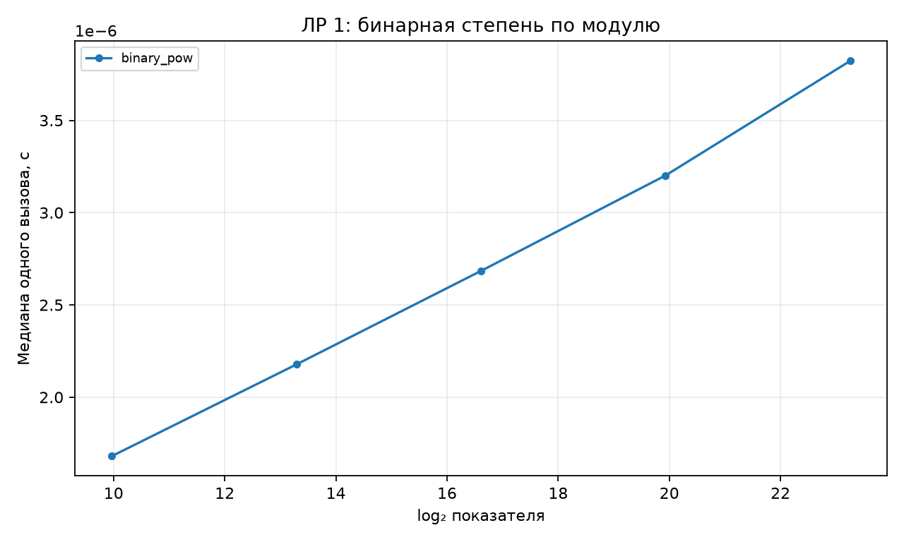
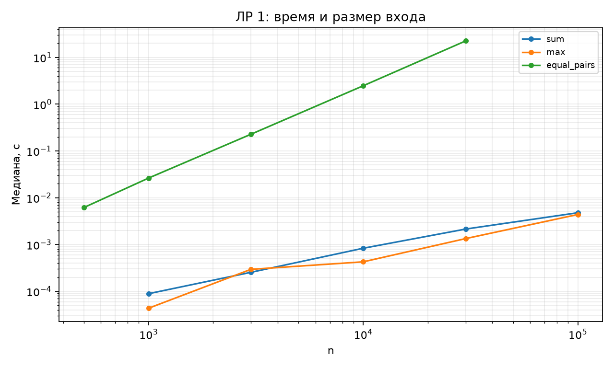

# Отчёт по ЛР 1. Анализ сложности

## Цель и выполненная работа

Реализованы алгоритмы и проверки, описанные в конспекте. Эксперимент выполнен на данных варианта 15, seed 45. В таблицах приведены фактические результаты запуска; время указано в секундах, если не оговорено иное.

## Условия и методика

CPU: 12th Gen Intel(R) Core(TM) i7-12650H. ОС: Windows-11-10.0.26200-SP0. Python 3.12.12, NumPy 2.5.3, Matplotlib 3.11.1. Дата и время UTC: 2026-09-10T18:24:34.061247+00:00.

Один прогрев и пять повторов на точку, итог — медиана time.perf_counter. Ввод, генерация и подготовка свежего состояния исключены из таймера. Фоновые процессы и питание не контролировались; задержки рабочего компьютера могут влиять на отдельные точки. Контрольные суммы данных находятся в environment.json.

## Результаты и их объяснение

| Алгоритм | Наклон log-log |
| --- | --- |
| sum | 0.876541 |
| max | 0.930777 |
| equal_pairs | 1.99447 |

Для пар наклон 1,994 близок к теоретическому 2. Для суммы 0,877 и максимума 0,931 близки к линейному порядку, но заметно отклоняются от 1: на небольшом диапазоне влияют постоянные затраты, шум и условия выполнения. Это наблюдение не меняет аналитический подсчёт Θ(n).

| Алгоритм | n | Медиана, с |
| --- | --- | --- |
| sum | 1000 | 8.9e-05 |
| sum | 3000 | 0.0002551 |
| sum | 10000 | 0.0008332 |
| sum | 30000 | 0.0021419 |
| sum | 100000 | 0.0047837 |
| max | 1000 | 4.35e-05 |
| max | 3000 | 0.0002952 |
| max | 10000 | 0.0004269 |
| max | 30000 | 0.0013388 |
| max | 100000 | 0.0043868 |
| equal_pairs | 500 | 0.0061865 |
| equal_pairs | 1000 | 0.0263289 |
| equal_pairs | 3000 | 0.227767 |
| equal_pairs | 10000 | 2.47259 |
| equal_pairs | 30000 | 22.4571 |

| Показатель | log₂ n | с/вызов |
| --- | --- | --- |
| 1000 | 9.96578 | 1.68027e-06 |
| 10000 | 13.2877 | 2.17713e-06 |
| 100000 | 16.6096 | 2.68383e-06 |
| 1000000 | 19.9316 | 3.2013e-06 |
| 10000000 | 23.2535 | 3.82185e-06 |

Бинарная степень измерена пакетами по 20 000 вызовов по модулю 1 000 000 007. Число итераций определяется битовой длиной показателя; число домножений результата зависит также от единичных битов, поэтому точки не обязаны лежать точно на прямой.

## Проверка и вывод о применимости

Проверки находятся в test_lab.py. Запуск: python -m pytest labs/lab01 -q. Применены граничные случаи, инварианты и независимые эталоны; состав тестов подробно разобран в конспекте. Проверки всего комплекта также сохранены в verification.txt в корне репозитория.

Вывод: принять для учебного использования в рамках явно описанных контрактов. Измерения подтверждают основные тенденции роста; ограничения реализаций и сравнения указаны выше и в конспекте. Автоматическая проверка не оценивает готовность к устной защите.

## Графики

## Исходные данные отчёта

CSV содержит медиану и все пять длительностей trial_1…trial_5. Вспомогательные таблицы без времени содержат точные счётчики или свойства структуры.

- [measurements.csv](results/measurements.csv)

- [powers.csv](results/powers.csv)

- [slopes.csv](results/slopes.csv)

- [Паспорт окружения и контрольные суммы](results/environment.json)
