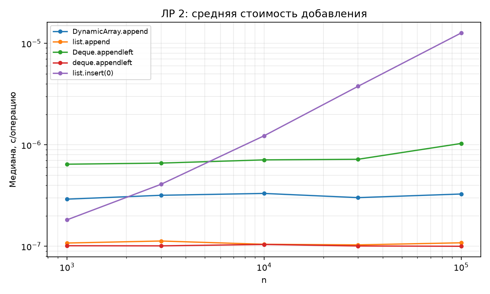
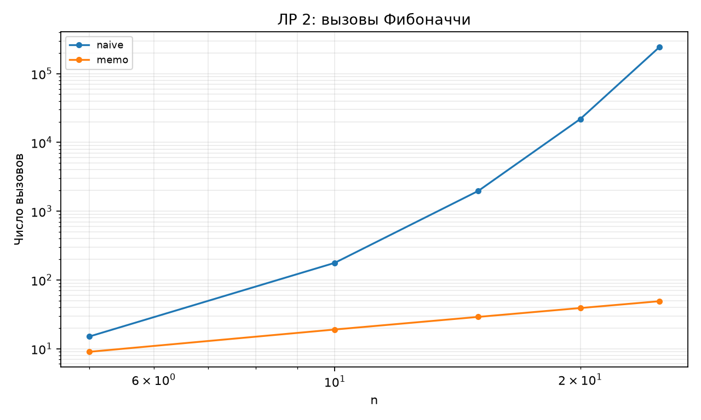

# Отчёт по ЛР 2. Рекурсия и линейные структуры

## Цель и выполненная работа

Реализованы алгоритмы и проверки, описанные в конспекте. Эксперимент выполнен на данных варианта 15, seed 45. В таблицах приведены фактические результаты запуска; время указано в секундах, если не оговорено иное.

## Условия и методика

CPU: 12th Gen Intel(R) Core(TM) i7-12650H. ОС: Windows-11-10.0.26200-SP0. Python 3.12.12, NumPy 2.5.3, Matplotlib 3.11.1. Дата и время UTC: 2026-09-10T18:24:44.768238+00:00.

Один прогрев и пять повторов на точку, итог — медиана time.perf_counter. Ввод, генерация и подготовка свежего состояния исключены из таймера. Фоновые процессы и питание не контролировались; задержки рабочего компьютера могут влиять на отдельные точки. Контрольные суммы данных находятся в environment.json.

## Результаты и их объяснение

| Операция | n | с/операцию |
| --- | --- | --- |
| DynamicArray.append | 100000 | 3.27809e-07 |
| list.append | 100000 | 1.08334e-07 |
| Deque.appendleft | 100000 | 1.03213e-06 |
| deque.appendleft | 100000 | 1.00128e-07 |
| list.insert(0) | 100000 | 1.2653e-05 |

Сравнивается средняя стоимость одной операции в серии из n добавлений в изначально пустую структуру. list.insert(0) сдвигает растущий массив; остальные операции избегают полного сдвига. У собственного DynamicArray расширения видны в общей работе, но их стоимость распределяется по серии.

| Фибоначчи | n | F(n) | Вызовы | Медиана, с |
| --- | --- | --- | --- | --- |
| naive | 5 | 5 | 15 | 2.70001e-06 |
| memo | 5 | 5 | 9 | 2.3e-06 |
| naive | 10 | 55 | 177 | 1.98e-05 |
| memo | 10 | 55 | 19 | 3.7e-06 |
| naive | 15 | 610 | 1973 | 0.0002341 |
| memo | 15 | 610 | 29 | 5.20001e-06 |
| naive | 20 | 6765 | 21891 | 0.002685 |
| memo | 20 | 6765 | 39 | 6.69999e-06 |
| naive | 25 | 75025 | 242785 | 0.0304263 |
| memo | 25 | 75025 | 49 | 8.39999e-06 |

| Диски | Получено ходов | 2ⁿ−1 |
| --- | --- | --- |
| 1 | 1 | 1 |
| 2 | 3 | 3 |
| 3 | 7 | 7 |
| 4 | 15 | 15 |
| 5 | 31 | 31 |
| 6 | 63 | 63 |
| 7 | 127 | 127 |
| 8 | 255 | 255 |
| 9 | 511 | 511 |
| 10 | 1023 | 1023 |
| 11 | 2047 | 2047 |
| 12 | 4095 | 4095 |
| 13 | 8191 | 8191 |
| 14 | 16383 | 16383 |
| 15 | 32767 | 32767 |

При 1025 добавлениях ёмкость равна 2048, скопировано 2047 ссылок. Вместе с новыми записями это 3072 действия, меньше бюджета 3·1025=3075 в модели записи/копирования. Полная таблица переходов ёмкости сохранена в growth.csv. Мемоизация устраняет повторное вычисление одинаковых подзадач; все полученные числа ходов Ханоя совпали с формулой.

## Проверка и вывод о применимости

Проверки находятся в test_lab.py. Запуск: python -m pytest labs/lab02 -q. Применены граничные случаи, инварианты и независимые эталоны; состав тестов подробно разобран в конспекте. Проверки всего комплекта также сохранены в verification.txt в корне репозитория.

Вывод: принять для учебного использования в рамках явно описанных контрактов. Измерения подтверждают основные тенденции роста; ограничения реализаций и сравнения указаны выше и в конспекте. Автоматическая проверка не оценивает готовность к устной защите.

## Графики

## Исходные данные отчёта

CSV содержит медиану и все пять длительностей trial_1…trial_5. Вспомогательные таблицы без времени содержат точные счётчики или свойства структуры.

- [append.csv](results/append.csv)

- [growth.csv](results/growth.csv)

- [hanoi.csv](results/hanoi.csv)

- [recursion.csv](results/recursion.csv)

- [Паспорт окружения и контрольные суммы](results/environment.json)
