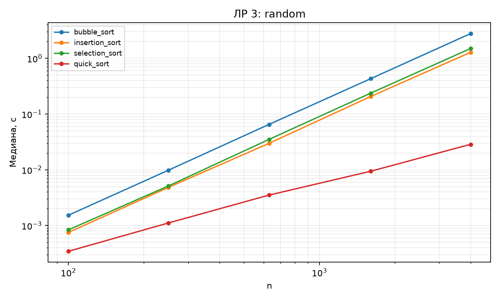
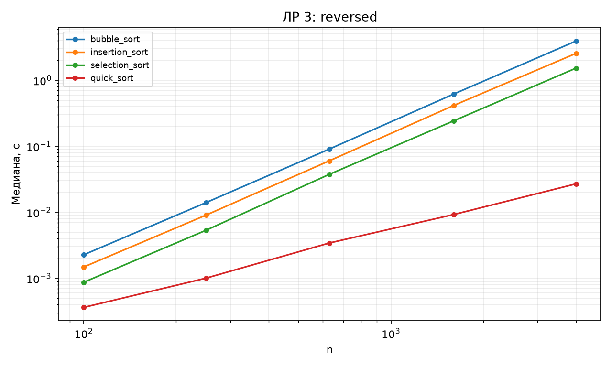
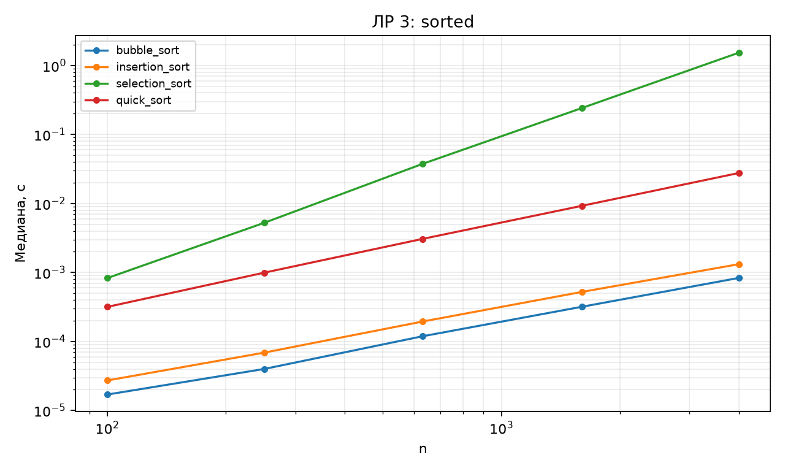

# Отчёт по ЛР 3. Простые сортировки и QuickSort

## Цель и выполненная работа

Реализованы алгоритмы и проверки, описанные в конспекте. Эксперимент выполнен на данных варианта 15, seed 45. В таблицах приведены фактические результаты запуска; время указано в секундах, если не оговорено иное.

## Условия и методика

CPU: 12th Gen Intel(R) Core(TM) i7-12650H. ОС: Windows-11-10.0.26200-SP0. Python 3.12.12, NumPy 2.5.3, Matplotlib 3.11.1. Дата и время UTC: 2026-09-10T18:26:52.030797+00:00.

Один прогрев и пять повторов на точку, итог — медиана time.perf_counter. Ввод, генерация и подготовка свежего состояния исключены из таймера. Фоновые процессы и питание не контролировались; задержки рабочего компьютера могут влиять на отдельные точки. Контрольные суммы данных находятся в environment.json.

## Результаты и их объяснение

| Вход | Алгоритм | Наклон |
| --- | --- | --- |
| random | bubble_sort | 2.0355 |
| random | insertion_sort | 2.019 |
| random | selection_sort | 2.03858 |
| random | quick_sort | 1.18866 |
| sorted | bubble_sort | 1.06748 |
| sorted | insertion_sort | 1.05984 |
| sorted | selection_sort | 2.0436 |
| sorted | quick_sort | 1.20928 |
| reversed | bubble_sort | 2.02525 |
| reversed | insertion_sort | 2.02831 |
| reversed | selection_sort | 2.0315 |
| reversed | quick_sort | 1.17387 |

На случайных входах наклоны трёх простых сортировок около 2; у QuickSort — 1,189, что согласуется с ростом n log n на исследованном интервале. На упорядоченных входах пузырёк и вставки имеют наклоны 1,067 и 1,060, а выбор сохраняет квадратичное число сравнений.

| Вход | Алгоритм | Сравнения | Обмены | Записи | с |
| --- | --- | --- | --- | --- | --- |
| random | bubble_sort | 7994840 | 4005670 | 8011340 | 2.78059 |
| random | insertion_sort | 4009663 | 0 | 4009669 | 1.28176 |
| random | selection_sort | 7998000 | 3994 | 7988 | 1.50099 |
| random | quick_sort | 85671 | 38755 | 77510 | 0.0286277 |
| sorted | bubble_sort | 3999 | 0 | 0 | 0.0008319 |
| sorted | insertion_sort | 3999 | 0 | 3999 | 0.0013169 |
| sorted | selection_sort | 7998000 | 0 | 0 | 1.5281 |
| sorted | quick_sort | 91334 | 33994 | 67988 | 0.0275994 |
| reversed | bubble_sort | 7998000 | 7997996 | 15995992 | 3.92268 |
| reversed | insertion_sort | 7998000 | 0 | 8001995 | 2.5481 |
| reversed | selection_sort | 7998000 | 2000 | 4000 | 1.52486 |
| reversed | quick_sort | 81635 | 28872 | 57744 | 0.0269057 |

Счётчики — отдельный контрольный запуск; временные повторы QuickSort используют следующие состояния того же генератора случайных чисел. Время всех четырёх алгоритмов включает ведение счётчиков.

| Алгоритм | Результат для [(2,a),(2,b),(1,c)] | Сохранён порядок |
| --- | --- | --- |
| bubble_sort | [[1, 'c'], [2, 'a'], [2, 'b']] | True |
| insertion_sort | [[1, 'c'], [2, 'a'], [2, 'b']] | True |
| selection_sort | [[1, 'c'], [2, 'b'], [2, 'a']] | False |
| quick_sort | [[1, 'c'], [2, 'b'], [2, 'a']] | False |

Пузырёк и вставки сохраняют a перед b; выбор и QuickSort переставляют эти метки. Пример доказывает нестабильность последних; стабильность первых обоснована строгими условиями сдвига и обмена в конспекте.

## Проверка и вывод о применимости

Проверки находятся в test_lab.py. Запуск: python -m pytest labs/lab03 -q. Применены граничные случаи, инварианты и независимые эталоны; состав тестов подробно разобран в конспекте. Проверки всего комплекта также сохранены в verification.txt в корне репозитория.

Вывод: принять для учебного использования в рамках явно описанных контрактов. Измерения подтверждают основные тенденции роста; ограничения реализаций и сравнения указаны выше и в конспекте. Автоматическая проверка не оценивает готовность к устной защите.

## Графики

## Исходные данные отчёта

CSV содержит медиану и все пять длительностей trial_1…trial_5. Вспомогательные таблицы без времени содержат точные счётчики или свойства структуры.

- [measurements.csv](results/measurements.csv)

- [slopes.csv](results/slopes.csv)

- [stability.csv](results/stability.csv)

- [Паспорт окружения и контрольные суммы](results/environment.json)
