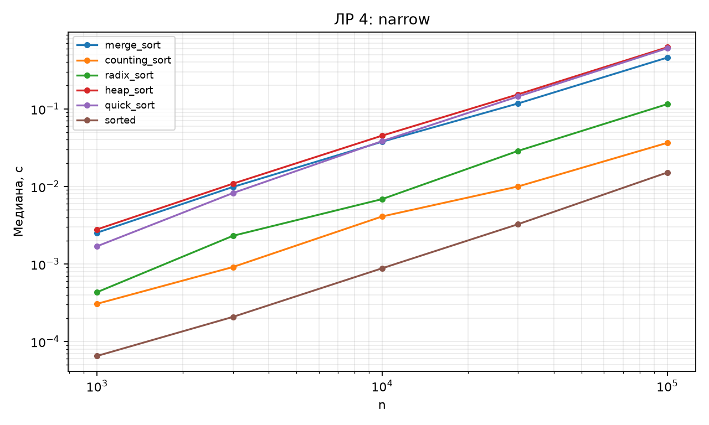
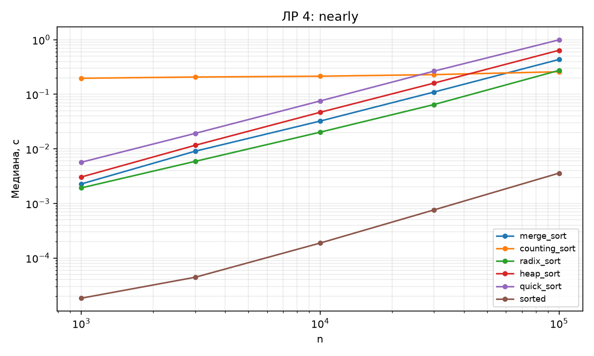
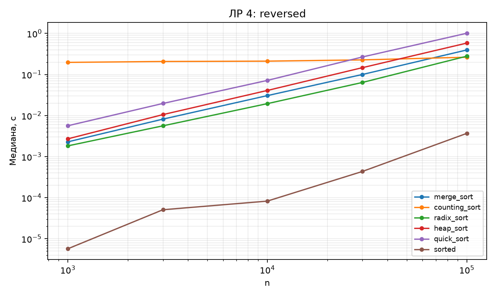
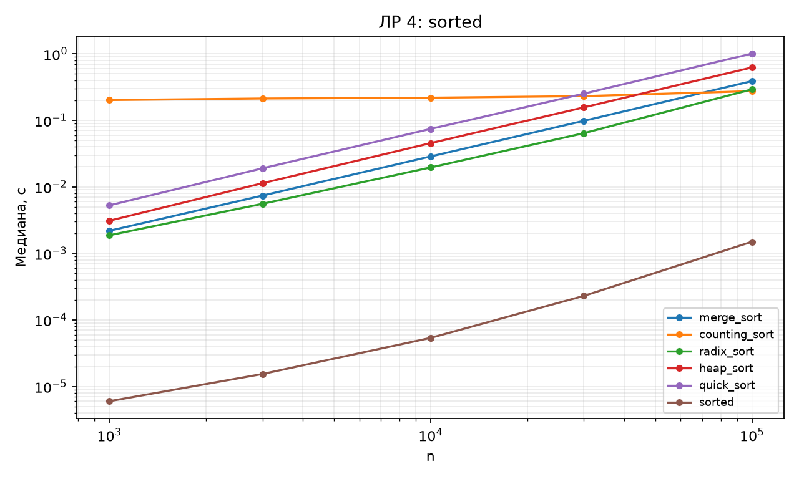
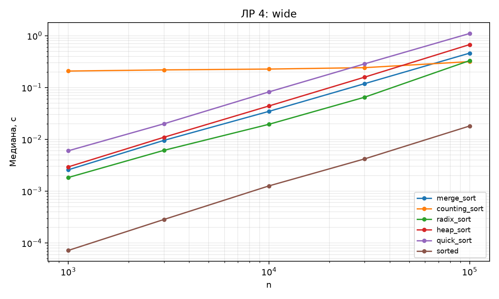

# Отчёт по ЛР 4. Эффективные сортировки

## Цель и выполненная работа

Реализованы алгоритмы и проверки, описанные в конспекте. Эксперимент выполнен на данных варианта 15, seed 45. В таблицах приведены фактические результаты запуска; время указано в секундах, если не оговорено иное.

## Условия и методика

CPU: 12th Gen Intel(R) Core(TM) i7-12650H. ОС: Windows-11-10.0.26200-SP0. Python 3.12.12, NumPy 2.5.3, Matplotlib 3.11.1. Дата и время UTC: 2026-09-10T18:29:14.393722+00:00.

Один прогрев и пять повторов на точку, итог — медиана time.perf_counter. Ввод, генерация и подготовка свежего состояния исключены из таймера. Фоновые процессы и питание не контролировались; задержки рабочего компьютера могут влиять на отдельные точки. Контрольные суммы данных находятся в environment.json.

## Результаты и их объяснение

| Вход | Алгоритм | K | Медиана, с |
| --- | --- | --- | --- |
| wide | merge_sort | 1999940 | 0.459073 |
| wide | counting_sort | 1999940 | 0.315174 |
| wide | radix_sort | 1999940 | 0.329488 |
| wide | heap_sort | 1999940 | 0.671727 |
| wide | quick_sort | 1999940 | 1.10013 |
| wide | sorted | 1999940 | 0.0180467 |
| narrow | merge_sort | 1000 | 0.457632 |
| narrow | counting_sort | 1000 | 0.0364277 |
| narrow | radix_sort | 1000 | 0.114914 |
| narrow | heap_sort | 1000 | 0.621409 |
| narrow | quick_sort | 1000 | 0.603698 |
| narrow | sorted | 1000 | 0.0150966 |
| sorted | merge_sort | 1999940 | 0.387641 |
| sorted | counting_sort | 1999940 | 0.274492 |
| sorted | radix_sort | 1999940 | 0.291561 |
| sorted | heap_sort | 1999940 | 0.621497 |
| sorted | quick_sort | 1999940 | 1.00408 |
| sorted | sorted | 1999940 | 0.001495 |
| reversed | merge_sort | 1999940 | 0.394731 |
| reversed | counting_sort | 1999940 | 0.26325 |
| reversed | radix_sort | 1999940 | 0.278887 |
| reversed | heap_sort | 1999940 | 0.580826 |
| reversed | quick_sort | 1999940 | 1.0085 |
| reversed | sorted | 1999940 | 0.0036791 |
| nearly | merge_sort | 1999940 | 0.434107 |
| nearly | counting_sort | 1999940 | 0.258622 |
| nearly | radix_sort | 1999940 | 0.27368 |
| nearly | heap_sort | 1999940 | 0.639326 |
| nearly | quick_sort | 1999940 | 0.993363 |
| nearly | sorted | 1999940 | 0.0035861 |

Широкий диапазон делает CountingSort дорогим даже при небольшом n: требуется обойти почти два миллиона счётчиков. На узком диапазоне объём этой работы существенно меньше. MergeSort и HeapSort не используют числовой диапазон, RadixSort зависит от количества разрядов.

Встроенный sorted выполняется в C и использует уже имеющуюся упорядоченность. QuickSort перенесён из ЛР 3 со счётчиками, новые сортировки работают без них; сравнение показывает конкретные реализации и не изолирует только асимптотику. Теоретическая таблица времени, памяти и стабильности приведена в конспекте.

На n=100000 для wide минимальная медиана у sorted: 0.0180467 с. Это вывод по данной точке, а не универсальный рейтинг.

На n=100000 для narrow минимальная медиана у sorted: 0.0150966 с. Это вывод по данной точке, а не универсальный рейтинг.

На n=100000 для sorted минимальная медиана у sorted: 0.001495 с. Это вывод по данной точке, а не универсальный рейтинг.

На n=100000 для reversed минимальная медиана у sorted: 0.0036791 с. Это вывод по данной точке, а не универсальный рейтинг.

На n=100000 для nearly минимальная медиана у sorted: 0.0035861 с. Это вывод по данной точке, а не универсальный рейтинг.

## Проверка и вывод о применимости

Проверки находятся в test_lab.py. Запуск: python -m pytest labs/lab04 -q. Применены граничные случаи, инварианты и независимые эталоны; состав тестов подробно разобран в конспекте. Проверки всего комплекта также сохранены в verification.txt в корне репозитория.

Вывод: принять для учебного использования в рамках явно описанных контрактов. Измерения подтверждают основные тенденции роста; ограничения реализаций и сравнения указаны выше и в конспекте. Автоматическая проверка не оценивает готовность к устной защите.

## Графики

## Исходные данные отчёта

CSV содержит медиану и все пять длительностей trial_1…trial_5. Вспомогательные таблицы без времени содержат точные счётчики или свойства структуры.

- [measurements.csv](results/measurements.csv)

- [Паспорт окружения и контрольные суммы](results/environment.json)
