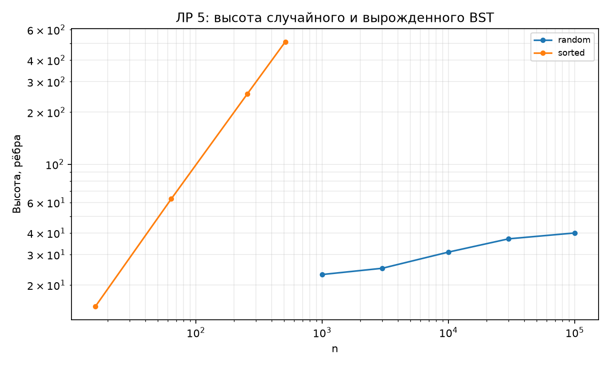
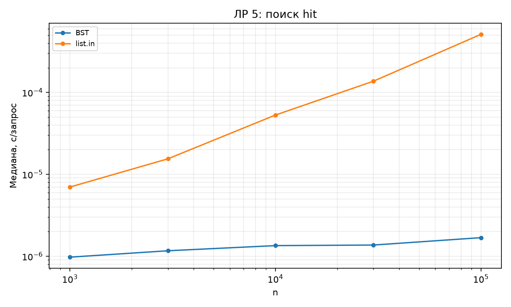
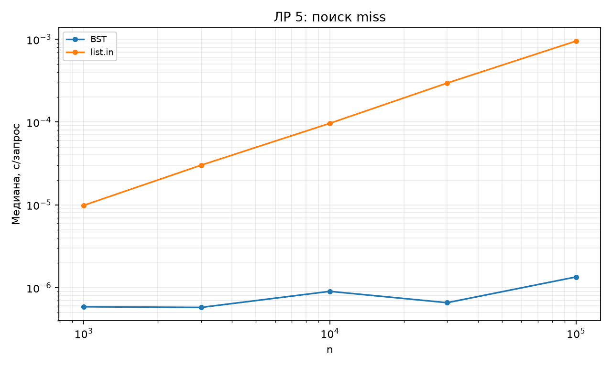

# Отчёт по ЛР 5. Бинарное дерево поиска

## Цель и выполненная работа

Реализованы алгоритмы и проверки, описанные в конспекте. Эксперимент выполнен на данных варианта 15, seed 45. В таблицах приведены фактические результаты запуска; время указано в секундах, если не оговорено иное.

## Условия и методика

CPU: 12th Gen Intel(R) Core(TM) i7-12650H. ОС: Windows-11-10.0.26200-SP0. Python 3.12.12, NumPy 2.5.3, Matplotlib 3.11.1. Дата и время UTC: 2026-09-10T18:29:16.963305+00:00.

Один прогрев и пять повторов на точку, итог — медиана time.perf_counter. Ввод, генерация и подготовка свежего состояния исключены из таймера. Фоновые процессы и питание не контролировались; задержки рабочего компьютера могут влиять на отдельные точки. Контрольные суммы данных находятся в environment.json.

## Результаты и их объяснение

| Порядок | Вставок | Уникальных | Высота |
| --- | --- | --- | --- |
| random | 1000 | 1000 | 23 |
| random | 3000 | 2994 | 25 |
| random | 10000 | 9981 | 31 |
| random | 30000 | 29780 | 37 |
| random | 100000 | 97522 | 40 |
| sorted | 16 | 16 | 15 |
| sorted | 64 | 64 | 63 |
| sorted | 256 | 256 | 255 |
| sorted | 512 | 512 | 511 |

| Запрос | Структура | с/запрос |
| --- | --- | --- |
| hit | BST | 1.68437e-06 |
| hit | list.in | 0.000511542 |
| miss | BST | 1.34531e-06 |
| miss | list.in | 0.000950916 |

При 100000 исходных значений случайное дерево имеет высоту 40; число уникальных узлов меньше из-за повторов. Упорядоченный контрольный вход даёт h=n−1. Поиск измеряется после построения; стоимость подготовки структуры в эти значения не входит. Для случайного BST логарифмическая высота является ожидаемым свойством, а не гарантией AVL.

## Проверка и вывод о применимости

Проверки находятся в test_lab.py. Запуск: python -m pytest labs/lab05 -q. Применены граничные случаи, инварианты и независимые эталоны; состав тестов подробно разобран в конспекте. Проверки всего комплекта также сохранены в verification.txt в корне репозитория.

Вывод: принять для учебного использования в рамках явно описанных контрактов. Измерения подтверждают основные тенденции роста; ограничения реализаций и сравнения указаны выше и в конспекте. Автоматическая проверка не оценивает готовность к устной защите.

## Графики

## Исходные данные отчёта

CSV содержит медиану и все пять длительностей trial_1…trial_5. Вспомогательные таблицы без времени содержат точные счётчики или свойства структуры.

- [heights.csv](results/heights.csv)

- [search.csv](results/search.csv)

- [Паспорт окружения и контрольные суммы](results/environment.json)
