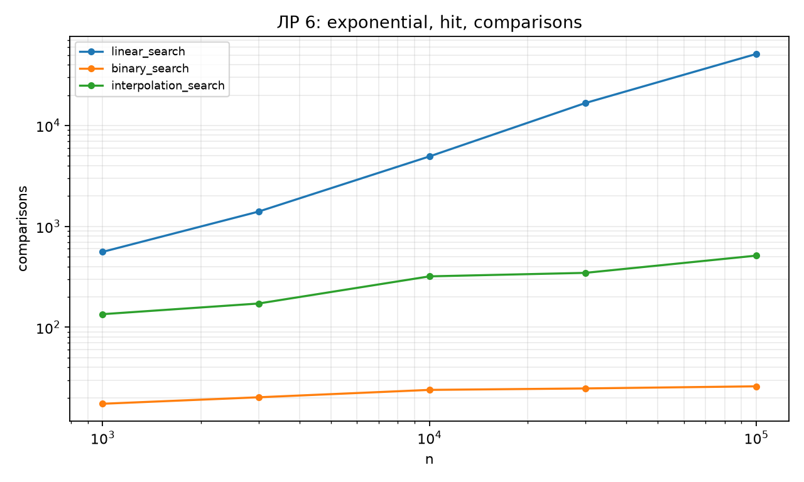
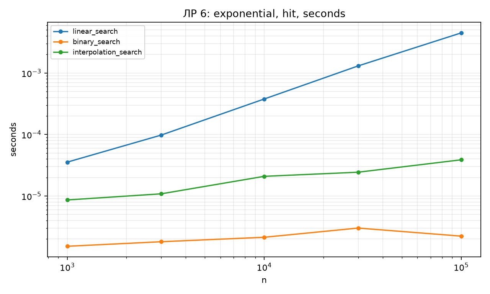
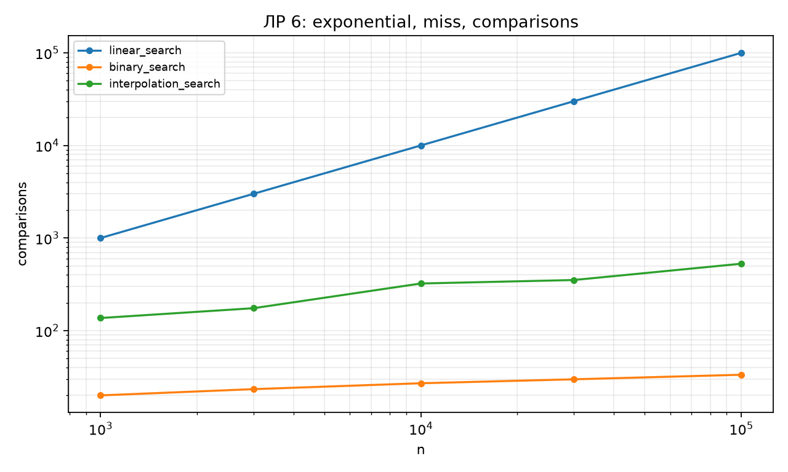
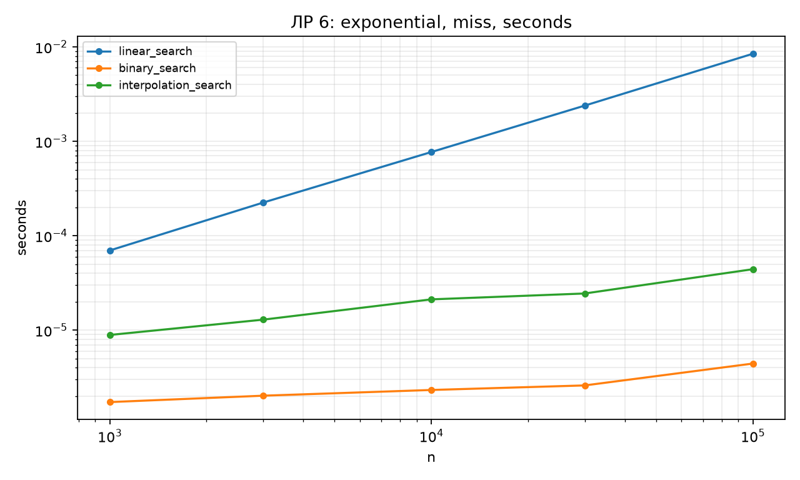
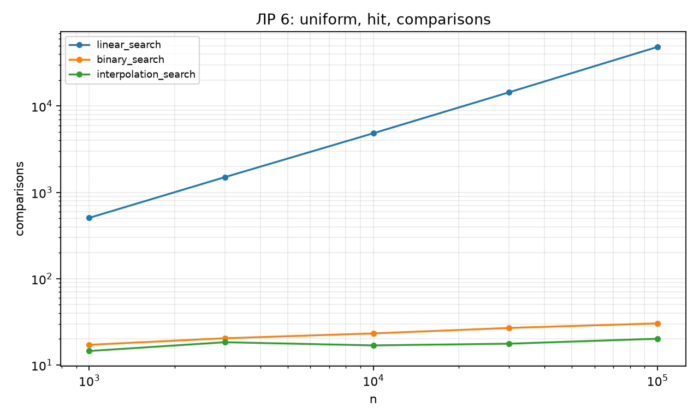
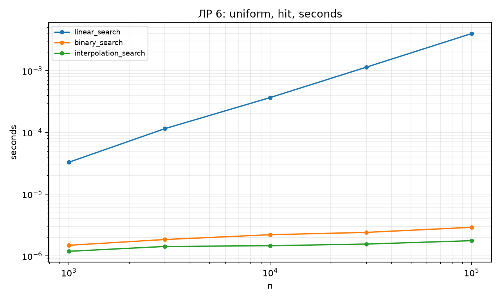
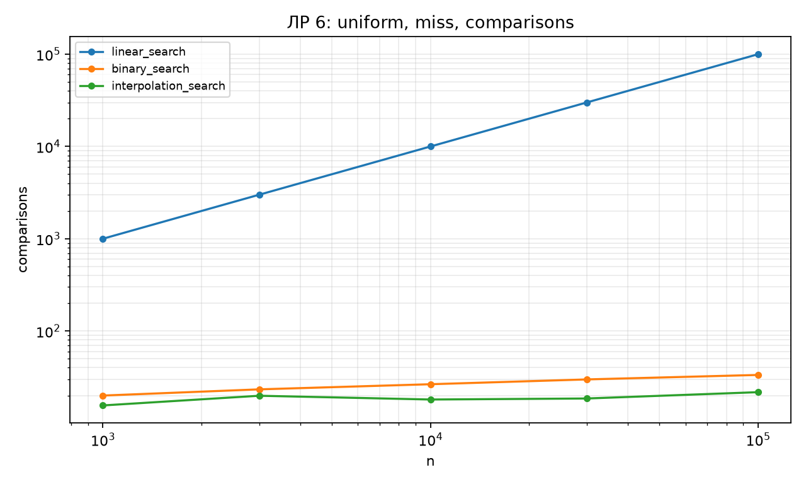
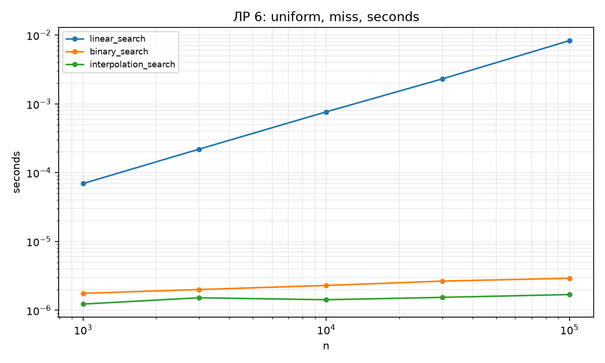
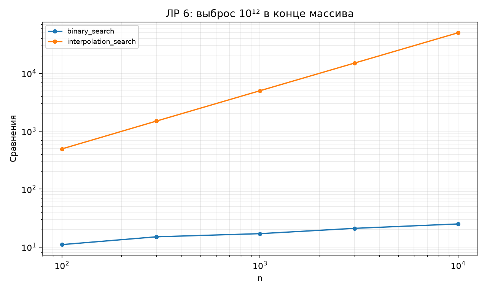

# Отчёт по ЛР 6. Поиск в массиве

## Цель и выполненная работа

Реализованы алгоритмы и проверки, описанные в конспекте. Эксперимент выполнен на данных варианта 15, seed 45. В таблицах приведены фактические результаты запуска; время указано в секундах, если не оговорено иное.

## Условия и методика

CPU: 12th Gen Intel(R) Core(TM) i7-12650H. ОС: Windows-11-10.0.26200-SP0. Python 3.12.12, NumPy 2.5.3, Matplotlib 3.11.1. Дата и время UTC: 2026-09-10T18:29:36.066560+00:00.

Один прогрев и пять повторов на точку, итог — медиана time.perf_counter. Ввод, генерация и подготовка свежего состояния исключены из таймера. Фоновые процессы и питание не контролировались; задержки рабочего компьютера могут влиять на отдельные точки. Контрольные суммы данных находятся в environment.json.

## Результаты и их объяснение

| Распределение | Запрос | Алгоритм | Сравнений/запрос | с/запрос |
| --- | --- | --- | --- | --- |
| uniform | hit | linear_search | 48479.1 | 0.00398298 |
| uniform | hit | binary_search | 30.375 | 2.90156e-06 |
| uniform | hit | interpolation_search | 20.1719 | 1.76406e-06 |
| uniform | miss | linear_search | 100000 | 0.00829491 |
| uniform | miss | binary_search | 33.4062 | 2.91406e-06 |
| uniform | miss | interpolation_search | 21.7344 | 1.68906e-06 |
| exponential | hit | linear_search | 51108.7 | 0.00448951 |
| exponential | hit | binary_search | 26 | 2.22969e-06 |
| exponential | hit | interpolation_search | 512.906 | 3.8825e-05 |
| exponential | miss | linear_search | 100000 | 0.00844681 |
| exponential | miss | binary_search | 33.3438 | 4.43594e-06 |
| exponential | miss | interpolation_search | 527.719 | 4.42422e-05 |

Сравнение учитывает проверки крайних значений у интерполяции. На каждом массиве 64 успешных и 64 отсутствующих запроса; отсутствие гарантировано чётностью ключей. Равномерная модель помогает оценке позиции, но меньшее число проб не обязательно компенсирует стоимость арифметики и дополнительных сравнений.

| Алгоритм | n | Сравнения | с |
| --- | --- | --- | --- |
| binary_search | 10000 | 25 | 5.20001e-06 |
| interpolation_search | 10000 | 49994 | 0.0059032 |

Контрольный вход [0,1,…,n−2,10¹²] показывает линейную деградацию интерполяции при поиске n−2. Основные экспоненциальные наборы и конструктивный худший случай рассматриваются отдельно: само название распределения ещё не доказывает конкретный результат.

## Проверка и вывод о применимости

Проверки находятся в test_lab.py. Запуск: python -m pytest labs/lab06 -q. Применены граничные случаи, инварианты и независимые эталоны; состав тестов подробно разобран в конспекте. Проверки всего комплекта также сохранены в verification.txt в корне репозитория.

Вывод: принять для учебного использования в рамках явно описанных контрактов. Измерения подтверждают основные тенденции роста; ограничения реализаций и сравнения указаны выше и в конспекте. Автоматическая проверка не оценивает готовность к устной защите.

## Графики

## Исходные данные отчёта

CSV содержит медиану и все пять длительностей trial_1…trial_5. Вспомогательные таблицы без времени содержат точные счётчики или свойства структуры.

- [inputs.csv](results/inputs.csv)

- [measurements.csv](results/measurements.csv)

- [worst_case.csv](results/worst_case.csv)

- [Паспорт окружения и контрольные суммы](results/environment.json)
