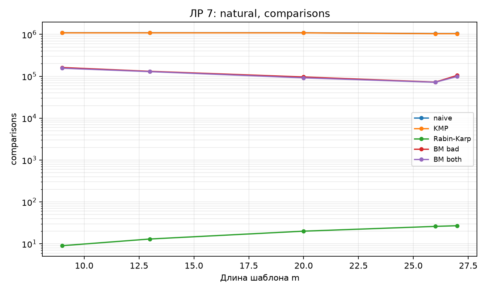
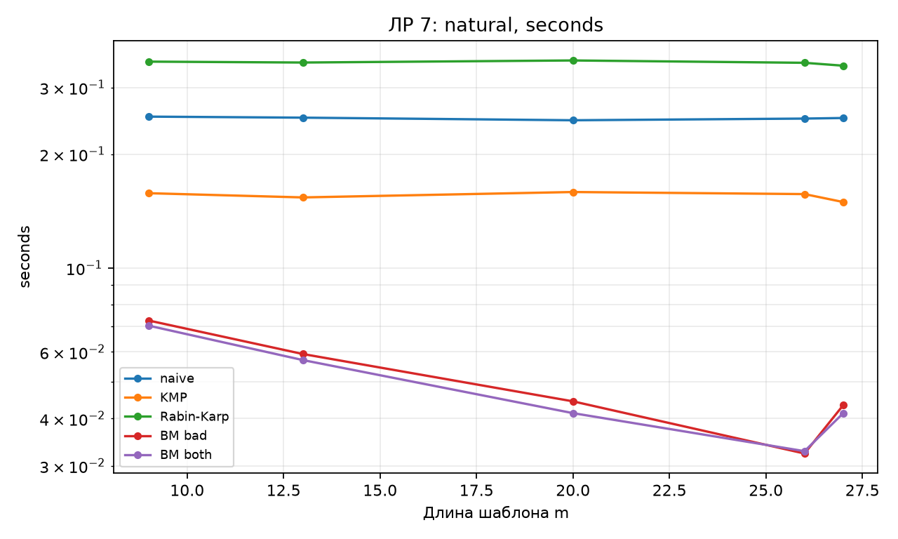
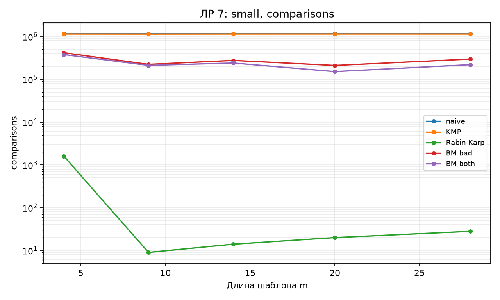
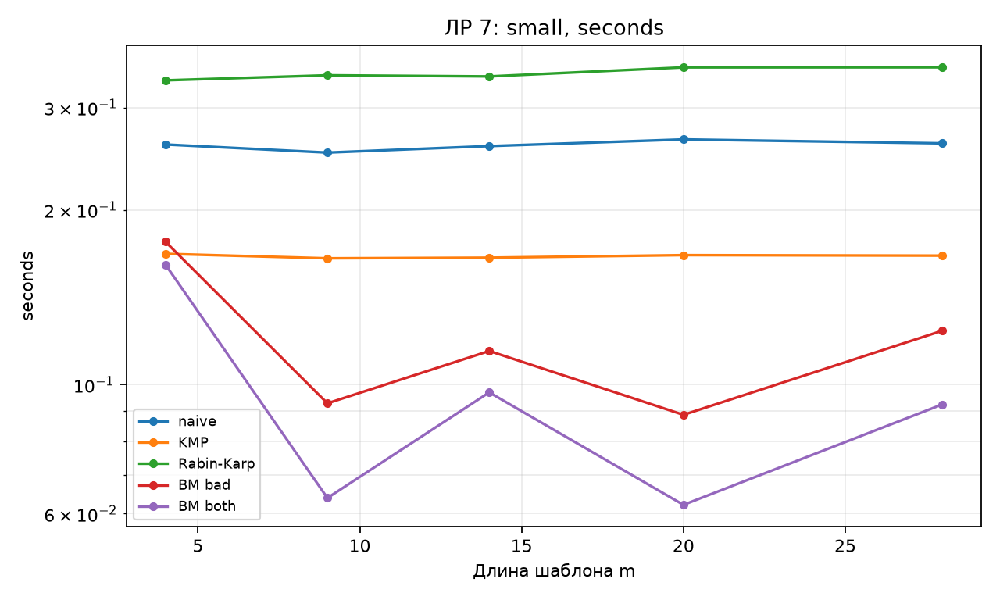

# Отчёт по ЛР 7. Поиск подстрок

## Цель и выполненная работа

Реализованы алгоритмы и проверки, описанные в конспекте. Эксперимент выполнен на данных варианта 15, seed 45. В таблицах приведены фактические результаты запуска; время указано в секундах, если не оговорено иное.

## Условия и методика

CPU: 12th Gen Intel(R) Core(TM) i7-12650H. ОС: Windows-11-10.0.26200-SP0. Python 3.12.12, NumPy 2.5.3, Matplotlib 3.11.1. Дата и время UTC: 2026-09-10T18:30:43.820661+00:00.

Один прогрев и пять повторов на точку, итог — медиана time.perf_counter. Ввод, генерация и подготовка свежего состояния исключены из таймера. Фоновые процессы и питание не контролировались; задержки рабочего компьютера могут влиять на отдельные точки. Контрольные суммы данных находятся в environment.json.

## Результаты и их объяснение

| ID | Алгоритм | m | Вхождений | Сравнения | с |
| --- | --- | --- | --- | --- | --- |
| 0 | naive | 9 | 1 | 1094572 | 0.25125 |
| 0 | KMP | 9 | 1 | 1087637 | 0.157646 |
| 0 | Rabin-Karp | 9 | 1 | 9 | 0.351163 |
| 0 | BM bad | 9 | 1 | 161867 | 0.0726441 |
| 0 | BM both | 9 | 1 | 155683 | 0.0704053 |
| 1 | naive | 14 | 1 | 1166574 | 0.257482 |
| 1 | KMP | 14 | 1 | 1142818 | 0.165448 |
| 1 | Rabin-Karp | 14 | 1 | 14 | 0.339294 |
| 1 | BM bad | 14 | 1 | 275883 | 0.114309 |
| 1 | BM both | 14 | 1 | 239979 | 0.0970108 |
| 2 | naive | 20 | 1 | 1094614 | 0.245755 |
| 2 | KMP | 20 | 1 | 1087580 | 0.158787 |
| 2 | Rabin-Karp | 20 | 1 | 20 | 0.353672 |
| 2 | BM bad | 20 | 1 | 96198 | 0.0444065 |
| 2 | BM both | 20 | 1 | 91859 | 0.0413286 |
| 3 | naive | 28 | 1 | 1166439 | 0.260302 |
| 3 | KMP | 28 | 1 | 1142832 | 0.166804 |
| 3 | Rabin-Karp | 28 | 1 | 28 | 0.351805 |
| 3 | BM bad | 28 | 1 | 296595 | 0.123885 |
| 3 | BM both | 28 | 1 | 219601 | 0.0925106 |
| 4 | naive | 13 | 1 | 1094460 | 0.24968 |
| 4 | KMP | 13 | 1 | 1087648 | 0.153646 |
| 4 | Rabin-Karp | 13 | 1 | 13 | 0.349236 |
| 4 | BM bad | 13 | 1 | 131187 | 0.0592313 |
| 4 | BM both | 13 | 1 | 129059 | 0.0570883 |
| 5 | naive | 4 | 400 | 1166763 | 0.259102 |
| 5 | KMP | 4 | 400 | 1143154 | 0.168002 |
| 5 | Rabin-Karp | 4 | 400 | 1600 | 0.334058 |
| 5 | BM bad | 4 | 400 | 417964 | 0.176185 |
| 5 | BM both | 4 | 400 | 378538 | 0.160852 |
| 6 | naive | 26 | 1 | 1048203 | 0.248278 |
| 6 | KMP | 26 | 1 | 1039693 | 0.15679 |
| 6 | Rabin-Karp | 26 | 1 | 26 | 0.348659 |
| 6 | BM bad | 26 | 1 | 72526 | 0.0323247 |
| 6 | BM both | 26 | 1 | 71939 | 0.0327898 |
| 7 | naive | 20 | 1 | 1167324 | 0.264327 |
| 7 | KMP | 20 | 1 | 1143568 | 0.16713 |
| 7 | Rabin-Karp | 20 | 1 | 20 | 0.351711 |
| 7 | BM bad | 20 | 1 | 210450 | 0.088769 |
| 7 | BM both | 20 | 1 | 151395 | 0.0621229 |
| 8 | naive | 27 | 1 | 1047951 | 0.249157 |
| 8 | KMP | 27 | 1 | 1039336 | 0.149411 |
| 8 | Rabin-Karp | 27 | 1 | 27 | 0.342595 |
| 8 | BM bad | 27 | 1 | 105076 | 0.0433509 |
| 8 | BM both | 27 | 1 | 99060 | 0.0412795 |
| 9 | naive | 9 | 1 | 1166134 | 0.25092 |
| 9 | KMP | 9 | 1 | 1139640 | 0.165035 |
| 9 | Rabin-Karp | 9 | 1 | 9 | 0.340804 |
| 9 | BM bad | 9 | 1 | 222982 | 0.0928932 |
| 9 | BM both | 9 | 1 | 210920 | 0.0638355 |

Чётные ID относятся к естественно-подобному тексту, нечётные — к малому алфавиту. Шаблон ID=5 длины 4 встречается 400 раз; остальные выбранные шаблоны — по одному разу. Все пять реализаций вернули одинаковые позиции.

Бойер–Мур способен перескакивать через участки текста; КМП ограничивает повторные сравнения префиксной функцией. Рабин–Карп выполняет арифметику каждого окна даже при малом числе символьных сравнений. Хороший суффикс добавляет стоимость предобработки, поэтому его преимущество оценивается по реальным точкам. Эти десять шаблонов различаются и длиной, и содержимым: график не является изолированным измерением влияния одной только длины.

## Проверка и вывод о применимости

Проверки находятся в test_lab.py. Запуск: python -m pytest labs/lab07 -q. Применены граничные случаи, инварианты и независимые эталоны; состав тестов подробно разобран в конспекте. Проверки всего комплекта также сохранены в verification.txt в корне репозитория.

Вывод: принять для учебного использования в рамках явно описанных контрактов. Измерения подтверждают основные тенденции роста; ограничения реализаций и сравнения указаны выше и в конспекте. Автоматическая проверка не оценивает готовность к устной защите.

## Графики

## Исходные данные отчёта

CSV содержит медиану и все пять длительностей trial_1…trial_5. Вспомогательные таблицы без времени содержат точные счётчики или свойства структуры.

- [measurements.csv](results/measurements.csv)

- [Паспорт окружения и контрольные суммы](results/environment.json)
