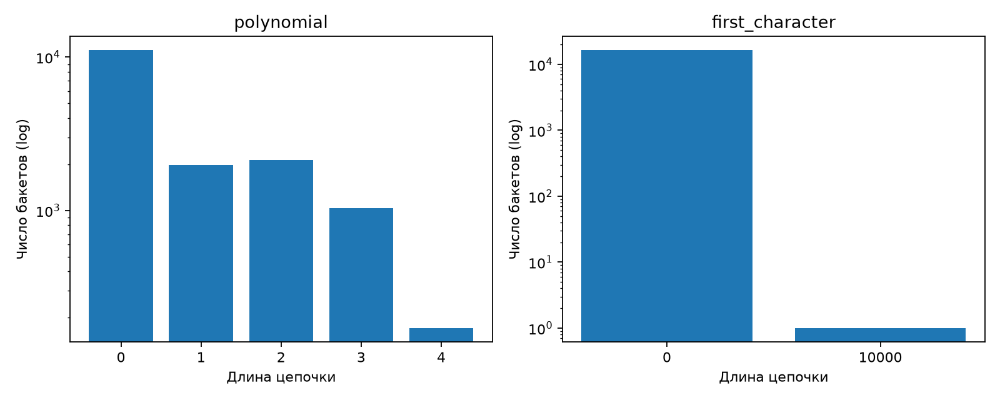
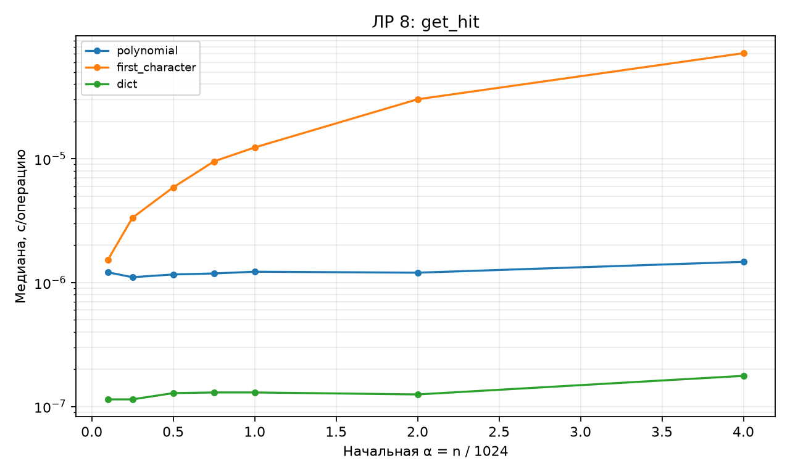
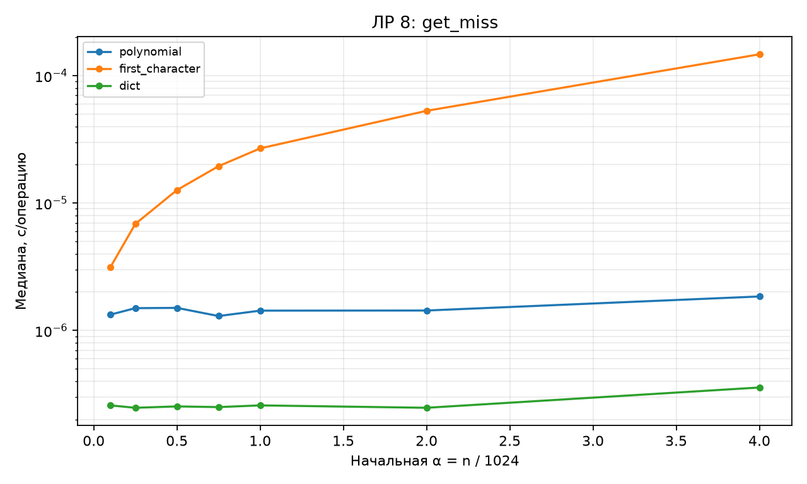
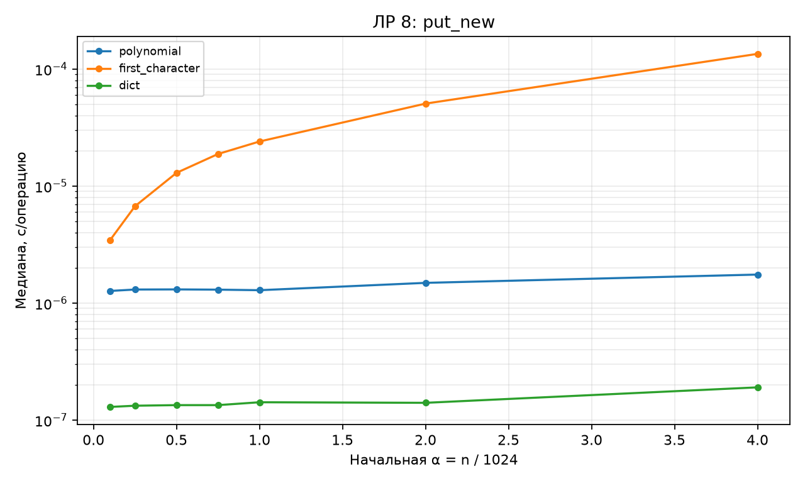
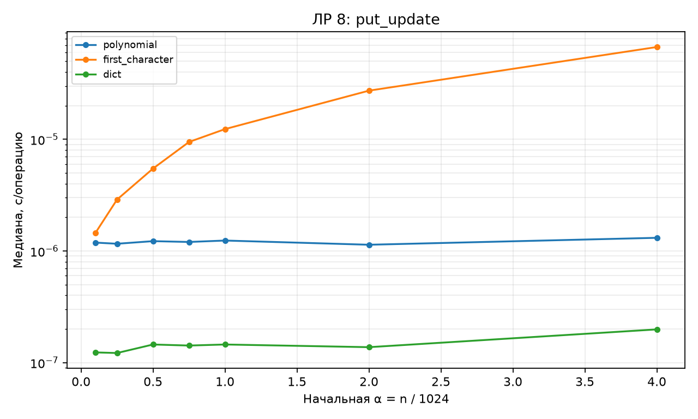

# Отчёт по ЛР 8. Хеш-таблица

## Цель и выполненная работа

Реализованы алгоритмы и проверки, описанные в конспекте. Эксперимент выполнен на данных варианта 15, seed 45. В таблицах приведены фактические результаты запуска; время указано в секундах, если не оговорено иное.

## Условия и методика

CPU: 12th Gen Intel(R) Core(TM) i7-12650H. ОС: Windows-11-10.0.26200-SP0. Python 3.12.12, NumPy 2.5.3, Matplotlib 3.11.1. Дата и время UTC: 2026-09-10T18:30:55.434837+00:00.

Один прогрев и пять повторов на точку, итог — медиана time.perf_counter. Ввод, генерация и подготовка свежего состояния исключены из таймера. Фоновые процессы и питание не контролировались; задержки рабочего компьютера могут влиять на отдельные точки. Контрольные суммы данных находятся в environment.json.

## Результаты и их объяснение

| Хеш | Длина цепочки | Бакетов | α |
| --- | --- | --- | --- |
| polynomial | 0 | 11085 | 0.610352 |
| polynomial | 1 | 1972 | 0.610352 |
| polynomial | 2 | 2124 | 0.610352 |
| polynomial | 3 | 1032 | 0.610352 |
| polynomial | 4 | 171 | 0.610352 |
| first_character | 0 | 16383 | 0.610352 |
| first_character | 10000 | 1 | 0.610352 |

При 10000 ключах и 16384 бакетах α≈0,61035. У полиномиальной функции максимальная цепочка имеет длину 4; функция первого символа помещает все 10000 ключей в один бакет. Распределение полиномиальной функции не идеально равномерно, но концентрация на этом наборе намного меньше.

| Реализация | Операция | α до | α после | с/операцию |
| --- | --- | --- | --- | --- |
| polynomial | get_hit | 4 | 4 | 1.47031e-06 |
| polynomial | get_miss | 4 | 4 | 1.84687e-06 |
| polynomial | put_update | 4 | 4 | 1.3125e-06 |
| polynomial | put_new | 4 | 4.0625 | 1.75312e-06 |
| first_character | get_hit | 4 | 4 | 7.10688e-05 |
| first_character | get_miss | 4 | 4 | 0.000147192 |
| first_character | put_update | 4 | 4 | 6.71984e-05 |
| first_character | put_new | 4 | 4.0625 | 0.000134742 |
| dict | get_hit | 4 | 4 | 1.76562e-07 |
| dict | get_miss | 4 | 4 | 3.5625e-07 |
| dict | put_update | 4 | 4 | 1.98438e-07 |
| dict | put_new | 4 | 4.0625 | 1.90625e-07 |

В контролируемом опыте авторасширение отключено, чтобы независимо менять α. Обычный режим таблицы по умолчанию расширяется после α>0,75, это проверено тестами. При put_new коэффициент меняется в течение 64 вставок; начальное и конечное значения сохранены. Для dict по горизонтали указана внешняя нагрузка n/1024, а не его внутренняя α. Стоимость rehash не входит в эти фиксированные по ёмкости замеры.

## Проверка и вывод о применимости

Проверки находятся в test_lab.py. Запуск: python -m pytest labs/lab08 -q. Применены граничные случаи, инварианты и независимые эталоны; состав тестов подробно разобран в конспекте. Проверки всего комплекта также сохранены в verification.txt в корне репозитория.

Вывод: принять для учебного использования в рамках явно описанных контрактов. Измерения подтверждают основные тенденции роста; ограничения реализаций и сравнения указаны выше и в конспекте. Автоматическая проверка не оценивает готовность к устной защите.

## Графики

## Исходные данные отчёта

CSV содержит медиану и все пять длительностей trial_1…trial_5. Вспомогательные таблицы без времени содержат точные счётчики или свойства структуры.

- [chains.csv](results/chains.csv)

- [operations.csv](results/operations.csv)

- [Паспорт окружения и контрольные суммы](results/environment.json)
